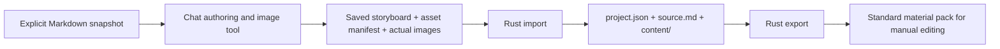

# MindFrame Architecture

## Primary boundary: chat-authored materials

The authoring environment owns understanding, narration, scene planning and image generation.
MindFrame owns local file validation and export. It is not a ChatGPT session/API proxy.

`crates/mindframe-core/src/lib.rs` retains Storyboard v1 and the legacy Timeline contract unchanged.
`materials.rs` adds Project/Assets/Cue contracts, portable paths, exact scene mapping, supplied-timing
validation and subtitle/CSV text helpers. Storyboard narration remains the only editable script authority.
Schemas are generated from Rust types; semantic quote entailment still needs human review.

`crates/mindframe-cli/src/materials.rs` owns local filesystem operations, real PNG/JPEG/WebP decoding,
PCM 16-bit WAV inspection and staged directory publication. It never calls Config, HTTP, TTS, Node or
FFmpeg. Image paths are explicit, normalized on import and copied byte-for-byte. Only manifest-listed
materials are copied. Complete source snapshots and configuration are not included in exports;
selected source quotations intentionally remain in key-points.md.

Project JSON distinguishes the new format from old root-level Storyboard/Timeline projects. A broken
project marker fails rather than falling back. init creates a source snapshot and authoring handoff;
import publishes content/ once; validate rechecks current edit sources; export regenerates previews
and writes to a fresh directory. No independent import-script editing authority, provider traits,
background jobs, dependency injection framework or persistent database is introduced.

## Timing and editor boundary

Missing recording/timings are valid. Export plain subtitles.txt and leave CSV time cells blank.
Optional user-supplied cues must exactly cover ordered narration items with matching text,
non-overlapping positive millisecond ranges and an end within the actual recording duration.
Only then export SRT. These checks do not verify speech alignment or authorship.

The export is not a native Jianying draft or automatic timeline. CSV and Markdown document placement
and transition intent; users create the actual editor tracks. Input image dimensions are reported,
not silently stretched to a platform preset. No claim is made about a tested editor UI/version.

## Failure and compatibility

Boundary checks reject unsupported formats, bad references, missing/corrupt media, traversal and
material symlinks. JSON limits are 2 MiB; source remains 64 KiB; raster files are at most50 MiB,
8192 pixels per side with256 MiB decoder allocation; WAV at most256 MiB and one hour.
These are supported-product limits, not a general untrusted-code sandbox.

Import/export publish from a same-parent temporary directory after preparation succeeds. Existing
content/ and exports are not overwritten. A local single writer is assumed; simultaneous edits to
source assets during copying are unsupported. Partial work is removed on normal errors.

The optional old API/media pipeline stays in pipeline.rs and renderer/remotion/. It has a distinct
root-level project format and separate dependency requirements. New material projects cannot
silently invoke produce/render. Existing Timeline and paid-provider behavior are preserved.

## Engineering and verification

EP-001 remains active under the existing RepoFoundry controller-unavailable template fallback.
No Harness activation, accepted ADR, approved Design, sealed Checkpoint or formal archival is claimed.

The chat-materials CI job runs Clippy, Rust tests and scripts/chat_smoke.py with the actual CLI.
Tests explicitly clear keys/PATH for the primary path. Synthetic rasters/silent WAVs prove file and
contract behavior, not model output quality. The original full-media CI remains independently visible.
