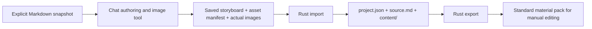

# MindFrame Architecture

## Primary boundary: chat-authored materials

The authoring environment owns understanding, narration, scene planning and image generation.
MindFrame owns local file validation and export. It is not a ChatGPT session/API proxy.

`crates/mindframe-core/src/lib.rs` retains Storyboard v1 and the legacy Timeline contract unchanged.
`materials.rs` adds Project/Assets/Cue contracts, portable paths, exact scene mapping, supplied-timing
validation and subtitle/CSV text helpers. Storyboard narration remains the only editable script authority.
Schemas are generated from Rust types; semantic quote entailment still needs human review.

`crates/mindframe-cli/src/materials.rs` owns local filesystem operations, real PNG/JPEG/WebP decoding,
PCM 16-bit WAV inspection and staged directory publication. The init/import/validate/export path never
calls Config, HTTP, TTS, Node or FFmpeg. Image paths are explicit, normalized on import and copied
byte-for-byte. Only manifest-listed materials are copied. Complete source snapshots and configuration
are not included in exports; selected source quotations intentionally remain in key-points.md.

The opt-in `motion` command reuses the same validated project and invokes the local Node/Remotion
renderer only after a real recording and complete reviewed cues exist. It does not call a model API,
TTS provider, ASR service or the legacy paid pipeline.

Project JSON distinguishes the new format from old root-level Storyboard/Timeline projects. A broken
project marker fails rather than falling back. init creates a source snapshot and authoring handoff;
import publishes content/ once; validate rechecks current edit sources; export regenerates previews
and writes to a fresh directory. No independent import-script editing authority, provider traits,
background jobs, dependency injection framework or persistent database is introduced.

## Timing and editor boundary

Missing recording/timings are valid. Export plain subtitles.txt and leave CSV time cells blank.
Optional user-supplied cues must exactly cover ordered narration items with matching text,
non-overlapping positive millisecond ranges and an end within the actual recording duration.
Only then export SRT. These checks do not verify speech alignment or authorship.

The export is not a native Jianying draft or automatic timeline. CSV and Markdown document placement
and transition intent; users create the actual editor tracks. Input image dimensions are reported,
not silently stretched to a platform preset. No claim is made about a tested editor UI/version.

## Motion rendering boundary

Motion V1 is a separate local rendering boundary for chat-material projects. Rust derives an internal
`motion-input.json` from already validated Storyboard/Assets data. Scene images remain raster assets;
`screen_text` is a separate emphasis layer; the imported `audio/narration.wav` is the single audio track;
sentence subtitles use supplied cue boundaries. Missing audio or cues fails before rendering.

The internal renderer contract requires 30fps, contiguous scene coverage, safe relative image/audio paths,
non-overlapping subtitles inside their owning scenes, bounded duration and known dimensions. Remotion
adds deterministic low-interference pan/zoom to each background, renders emphasis text independently,
and produces H.264/AAC MP4 plus a still cover. Output is staged and published only after successful media
generation.

Motion V1 deliberately does not infer cue timing, perform speech recognition, accept MP4 background loops,
provide word-level karaoke, expose an arbitrary animation DSL, or emit a native Jianying project. Those
capabilities require separate contracts and verification rather than weakening the current timing boundary.

## Motion Primitives boundary

An optional `content/motion.json` adds sentence-paced visual states without changing Storyboard or Assets.
Core owns the strict `MotionPlan` contract. A scene plan contains ordered steps bound to zero-based
`narration` indices; frame timing is derived only from the matching reviewed cue. Each step is a complete
state snapshot, not an executable action script.

The supported visual vocabulary is deliberately small: text, stat, relation, matrix and formula. Placement is
limited to top/left/center/right/bottom slots. Reusing an element id preserves semantic identity across steps;
changed values are rendered as replacements, new ids enter, omitted ids exit, and emphasis marks the current
focus. The renderer keeps unchanged elements visually stable across step boundaries so a sentence can add one
piece of information without flashing the whole composition.

Rust rejects unknown fields, invalid scene/utterance references, duplicate ids, relations whose endpoints are
not present in the same state, malformed small matrices and formula highlights that are not literal substrings
of the displayed formula. The renderer repeats these safety/shape checks at its external JSON boundary and
requires every timed step to have a matching subtitle cue. No JavaScript, CSS, React source, pixel coordinates
or arbitrary animation commands are accepted from authored content.

Projects without `motion.json` retain the simpler Motion V1 `screen_text` path. Import/validate/export preserve
the optional plan; `init` embeds its generated schema. This compatibility is intentional: richer explainers do
not complicate the minimum static-material workflow.

## Failure and compatibility

Boundary checks reject unsupported formats, bad references, missing/corrupt media, traversal and
material symlinks. JSON limits are 2 MiB; source remains 64 KiB; raster files are at most50 MiB,
8192 pixels per side with256 MiB decoder allocation; WAV at most256 MiB and one hour.
These are supported-product limits, not a general untrusted-code sandbox.

Import/export publish from a same-parent temporary directory after preparation succeeds. Existing
content/ and exports are not overwritten. A local single writer is assumed; simultaneous edits to
source assets during copying are unsupported. Partial work is removed on normal errors.

The optional old API/media pipeline stays in pipeline.rs and renderer/remotion/. It has a distinct
root-level project format and separate dependency requirements. New material projects cannot
silently invoke produce/render. Existing Timeline and paid-provider behavior are preserved.

## Engineering and verification

EP-001 remains active under the existing RepoFoundry controller-unavailable template fallback.
No Harness activation, accepted ADR, approved Design, sealed Checkpoint or formal archival is claimed.

The chat-materials CI job runs Clippy, Rust tests and scripts/chat_smoke.py with the actual CLI.
Tests explicitly clear keys/PATH for the primary path. Synthetic rasters/silent WAVs prove file and
contract behavior, not model output quality. The original full-media CI remains independently visible.
