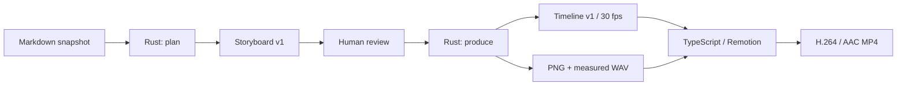

# MindFrame V1 Architecture

## Scope

A CLI for one explicit Markdown source, inspectable content planning, speech/image production,
and two local video layouts. No vault scanning, research agent, job scheduler, Web UI or upload integration.

## Code boundaries

`crates/mindframe-core/src/lib.rs` owns the serializable Storyboard/Timeline contracts,
source-reference checks, scene invariants and SRT export. Schemas are derived with schemars,
not separately hand-maintained. The old unversioned scaffold format is intentionally unsupported.

`crates/mindframe-cli/src/main.rs` owns command selection and early argument checks.
`pipeline.rs` owns explicit file I/O, one concrete HTTP implementation for each endpoint contract,
local eSpeak, and FFmpeg/Node subprocesses. There are two crates, no speculative provider traits,
no async runtime and no orchestration framework.

`renderer/remotion/render.mjs` owns local dependency checks, bundling, MP4 and cover output.
`contract.mjs` rejects malformed timeline inputs and arbitrary media paths at the JS process boundary.
`src/index.tsx` owns the six visual templates and non-overlapping scene entrances. Source notes and
credentials are not included in the browser's served public directory.

## Commands and authority

`plan` is the only LLM stage. `produce` reads a reviewed storyboard; it does not decide what the
source means. `render` makes no model requests and allows visual edits when scene IDs, order and
narration remain unchanged. The source snapshot and exact quote checks preserve provenance;
semantic entailment still requires human review.

## Media timing

Each narration item is synthesized independently, normalized to 48 kHz mono PCM, measured by
ffprobe and padded to a multiple of 1600 samples (one 30 fps frame). Ordered clips are contiguous.
The complete voice track, SRT and Remotion sequences share those frame boundaries. Entrance
animations do not overlap scenes or subtract time from speech.

## Failure and recovery

Unsupported input, absent credentials and dependencies fail before paid operations when these
conditions are locally knowable. There are no silent model fallbacks or paid retries. Media
production reserves an assets directory and leaves partial output on failure; a new project is
required for regeneration. A render writes pending files and promotes only successful outputs.
This is a local, single-writer project workflow, not a concurrent service.

## Engineering tracking

EP-001 uses RepoFoundry's execution-plan template fallback because its controller cannot be
installed in the current network-restricted coding environment. Repository inspection found no
existing EP, index or high-water state; EP-001 was allocated from that empty inventory. This is
not a claim that Harness bootstrap, Spec activation, controller validation or archival ran.
No accepted ADR, approved Design revision or sealed Checkpoint is fabricated.

## Verification

`scripts/check.py` is the canonical Rust/TypeScript unit and static-check entrypoint.
`scripts/integration_test.py` runs loopback provider contracts and real media rendering.
CI exports generated schemas, dependency resolution, videos and verification.json. Live API
compatibility, artistic quality and publishing suitability are distinct from fixture-test success.
