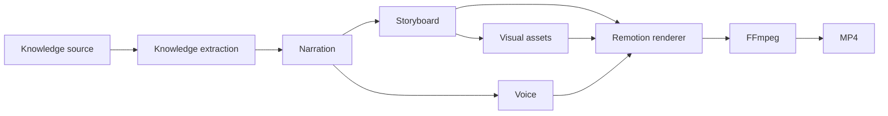

# MindFrame Architecture

## Purpose

MindFrame converts trusted knowledge material into an editable, inspectable video plan and then into rendered media.

The system treats the user's knowledge base as the content source. AI components are responsible for editing, explanation structure, narration, and visual planning rather than inventing the underlying knowledge.

## Main path

## V0.1 boundary

The first implementation establishes only contracts that the main path requires.

### Rust workspace

- `mindframe-core`: domain types and storyboard validation.
- `mindframe-cli`: command-line entrypoint and top-level orchestration.

Additional crates are created only when there is demonstrated complexity or independent lifecycle. We do not pre-create provider, storage, or renderer abstraction layers merely for future flexibility.

### Storyboard contract

The storyboard is the stable boundary between content planning and rendering.

Initial visual scene types:

- title;
- key point;
- image;
- quote;
- diagram;
- code.

The schema is intentionally small. New scene types require a concrete publishing need.

## Error ownership

- CLI validates external arguments and input paths.
- Core validates storyboard/domain invariants.
- Renderer validates renderer-specific constraints.
- Internal layers do not repeat validations already guaranteed by upstream contracts.

Unsupported input should fail explicitly rather than trigger multi-step fallback behavior.

## Rendering

Remotion is the intended rendering layer because the product requires programmatic text layout, diagrams, code blocks, image composition, animation, and timeline control.

Rust will invoke the renderer as a separate process first. Direct media-library bindings are not part of V0.1.

## Engineering governance

RepoFoundry AI owns durable engineering artifacts:

- architecture and design documentation;
- ADRs for durable technical decisions;
- execution plans for bounded implementation work;
- checkpoints for verified progress.

The repository remains the source of truth.
