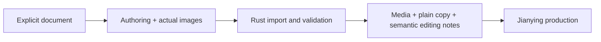

# MindFrame Architecture

## Product boundary: editor material pack

The authoring host owns interpretation, source-faithful narration, emphasis copy and actual image generation.
MindFrame owns local validation and editor handoff. Jianying is the intended place for voice, caption timing,
transitions, effects and final editing. No model call, audio, Node or FFmpeg is required by the primary CLI path.

## Contracts and ownership

Two Rust crates remain. core/lib.rs owns unchanged Storyboard/legacy Timeline v1; core/materials.rs owns
unchanged Project/Assets/Cue/MotionPlan v1. core/editor.rs adds optional Layers v1 plus pure editorial text
formatting. Layers is a separate manifest, not new fields smuggled into the strict Assets schema.

A base image remains mandatory per scene. Layers registers additional actual rasters with scene ID, per-scene
layer ID, file, label and optional narration index. There are at most12 overlays per scene. Core validates
portable paths, IDs, scene membership and index bounds. This is not an animation language or editable editor
object model. Normalizing the manifest never invents image layers from one flat file.

Storyboard narration remains the sole script edit authority. assets.screen_text holds explicit later overlays,
not automatically inferred image text. Optional motion.json represents full visual states at narration indices;
editor export describes add/keep/update/remove and preserves formula/matrix/relation content without audio.
Only explicit preview rendering translates reviewed cue times to frames.

## Primary I/O

cli/materials.rs handles init/import/validate/export, actual PNG/JPEG/WebP decoding, PCM16 WAV inspection,
path/symlink controls and atomic fresh-directory publication. cli/editor_export.rs derives narration.txt,
scripts/, screen-text/, edit-guide.md, edit-notes/, existing shot-list.csv and the material report.
These modules never invoke Node, FFmpeg, TTS, ASR or an editor. They use existing serialization/filesystem
helpers only. No new dependency, provider framework, database, background job or paid service is added.

Imported bytes are preserved. Canonical images/overlays/cover/audio paths are written back into their manifests.
Only contract-listed media is copied, not source snapshots, API configs, arbitrary working notes or preview
videos. Selected source quotations intentionally remain in key-points.md. Exports are deterministic derivatives
of current JSON; stale script.md is not read. Existing file names, seven CSV columns and plain subtitle fallback
remain compatible. Optional layers.json is ignored only when absent; malformed files fail, not fall back.

## Inspection is not visual acceptance

The report includes actual dimensions and observed transparent pixels. Reference-canvas/ratio warnings apply
to base images and cover, not small overlay graphics. Opaque overlays and missing optional cover are review
warnings, not hard failure. Reference canvases are project design assumptions, not platform certification.
Nothing is automatically stretched, upscaled, flattened or declared artistic/publish-ready.

No audio/cues means untimed text and semantic triggers, never invented SRT. Supplied cues must match every
narration, be positive/non-overlapping and end within the actual WAV. File/timing validation is not listening,
forced alignment or correctness proof. Voice or speed changes invalidate the old synchronization.

## Optional preview and legacy code

cli/preview.rs isolates the former Motion orchestration. `preview` is the canonical CLI name; `motion` remains
an alias. It retains the former renderer, file names and timing requirements, adds explicit PREVIEW.txt and
preview-report.json (publish_ready=false), and is never invoked by export. Layers are not composited by this
old preview; fail before launching Node rather than silently omit them. The renderer itself is not extended.

The separate root-level legacy project format and pipeline.rs remain compatible. API production is still
explicitly opt-in and may incur charges; there is no automatic fallback from material export. Existing media
CI is retained as regression protection, not a promise of final publishing quality.

## Failure, limits and verification

JSON limit2MiB; source64KiB; each raster50MiB, 8192px/side, decoder budget256MiB; WAV256MiB/one hour.
These are product limits, not a general untrusted-code sandbox. Paths are validated at the contract boundary,
then filesystem components are inspected for symlinks. A same-parent temporary directory is published only
on successful preparation; existing directories are not overwritten. Concurrent edits/writes are unsupported.

Actual PATH-empty CLI tests cover old minimal projects, layered files, pure copy, semantic instructions,
malformed input, non-overwrite and optional preview guardrails. Synthetic rasters/audio verify file behavior,
not artwork quality, narration quality or user-version Jianying UI acceptance.

The owner's material-first clarification is captured in docs/exec-plans/active/ep-001_v1/editor-materials-first.md.
EP-001 remains active with the documented RepoFoundry controller-unavailable bounded-record fallback. No
Harness activation, accepted ADR, sealed checkpoint or formal archival approval is inferred or invented.
