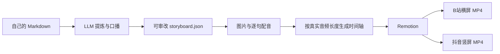

# MindFrame

**让自己的知识变成有画面、有旁白、可审改的视频。**

V1（crate 版本 `0.1.0`）是本地 CLI，不是 SaaS，也不会扫描或上传整个知识库。
输入一篇 Markdown，输出关键信息、口播稿、分镜、配图、配音、字幕与 MP4。



## 安装

需要 Rust（支持 edition 2024）、Node.js 22、FFmpeg/ffprobe，以及中文字体。
默认 Remotion 会下载浏览器，也可以设置 `REMOTION_BROWSER_EXECUTABLE` 为已有 Chromium 的绝对路径。

在仓库根目录运行：

```bash
# Ubuntu / Debian；本地 demo 还需要 espeak。
sudo apt-get install ffmpeg espeak fonts-noto-cjk
npm --prefix renderer/remotion install
cargo build --workspace
cargo install --path crates/mindframe-cli
```

macOS 可安装对应的 FFmpeg 和 eSpeak；本版本的自动化验收环境为 Linux。
在仓库外运行时，用 `--renderer /absolute/path/to/MindFrame/renderer/remotion` 指定渲染器。

## 先看不收费的演示

```bash
mindframe demo --out output/demo --preset both --scale 0.5
```

它使用仓库内**人工编写的演示分镜与 eSpeak 合成音**，不是在线 LLM 结果，
也不代表云端自然语音或 AI 配图的质量。首次安装依赖与下载浏览器仍需联网。
`--scale 0.5` 是半分辨率预览；省略则为全高清。

## 用自己的材料生成

```bash
cp mindframe.example.toml mindframe.toml
export OPENAI_API_KEY='在自己的终端设置，不提交到仓库'

# 一次完成。模型调用按所配置服务计费，不会自动重试或切换供应商。
mindframe build /path/to/vault/article.md --out output/article --preset both
```

配置中的模型名称可按自己的账号可用模型修改。LLM 使用 Chat Completions JSON 模式；
TTS 使用 Speech WAV 接口；图片接口使用 GPT Image 的 PNG/base64 契约。
这不意味着任意宣称“兼容”的服务都支持全部三个接口。

**更适合正式发布的操作方式：先审核内容，再制作。**

```bash
mindframe plan /path/to/vault/article.md --out output/article
# 审核并修改 output/article/storyboard.json
mindframe validate output/article
mindframe produce output/article --preset both
```

`storyboard.json` 是编辑源。修改其 `narration` 数组来调整口播；`script.md` 与
`key-points.md` 是导出预览，`produce` 会重新生成它们，不要直接编辑导出文件。
每个旁白短句单独配音、测量、补齐到 30 fps 的完整帧；字幕和画面使用同一组时间戳，
不靠字数估算。逐句合成会增加请求次数，句间语气连贯性需要试听。

## 画面与转场

支持标题、关键点卡片、AI 配图、原文引用、Mermaid 流程图、代码文字。
转场支持硬切、淡入、位移入场，场景不重叠，不会让两段旁白同时播放。
代码只作为画面文字展示，绝不执行。Mermaid V1 仅支持无 HTML、链接或配置指令的流程图。

```bash
# 更改标题、卡片、流程图或 transition 后免费重渲染；不再次调用模型。
mindframe render output/article --preset both
```

重渲染会验证旁白、场景 ID 与顺序未改变，避免新稿搭配旧声音。
改旁白或场景数量后，请将 `source.md` 和 `storyboard.json` 复制到一个**新的项目目录**再 `produce`。
修改图片提示词不会自动重新生成图片；也可用自己的 PNG 替换 `assets/<scene-id>.png` 后重渲染。

## 输出

```text
output/article/
├── source.md                  # 所选素材的原始快照
├── planner-response.txt        # 原始模型输出，失败时也可检查
├── key-points.md               # 观点与素材行号、逐字引用
├── script.md                  # 口播导出
├── storyboard.json            # 内容编辑源
├── assets/                    # PNG 和逐句 WAV
├── voice.wav                  # 完整旁白，48 kHz 单声道 PCM
├── subtitles.srt              # 与真实音频时间轴对应
├── timeline.json              # 制作时冻结的音频/分镜快照
├── render-input.json           # 本次视觉编辑快照
├── bilibili.mp4               # 默认 1920×1080，H.264 + AAC
├── douyin.mp4                 # 默认 1080×1920，H.264 + AAC
├── cover-bilibili.png
└── cover-douyin.png
```

两个平台预设只改变画面布局，**不自动把长内容剪成短视频**。不同篇幅应分别规划。
输出目录禁止覆盖；已存在的 `assets/` 禁止自动重新收费生成。
制作失败时保留中间产物供检查，V1 没有断点续费重试与局部 TTS 重生成。
渲染失败可直接再次 `render`，已有有效 MP4 不会被失败的半成品替换。

## 内容与隐私边界

只读取你选择的单个 UTF-8 `.md` 文件，上限 64 KiB。PDF、整库检索、附件自动解析暂不支持。
API 规划会把这篇素材发给配置的 LLM；配音发送口播，配图发送图片提示词。
没有默认联网研究，没有发布账号接入，也不会自动发布到任何平台。

引用校验能发现不存在的行号、非逐字引用与错误索引，**不能证明哲学解读或技术结论正确**。
公开前仍需审核观点、语音读法、文字布局、素材许可和 AI 内容标识要求。
凭据只从环境变量读取；生产配置和输出目录已被 Git 忽略。错误日志不输出 API 响应正文。

## 开发与验收

```bash
python3 scripts/check.py
cargo run -p mindframe-cli -- schema --out output/schemas
python3 scripts/integration_test.py --out output/integration
```

集成测试使用本地 HTTP 假服务验证三个供应商接口，但真正执行 Rust CLI、eSpeak、FFmpeg
和 Remotion，检查六种画面、横竖 MP4、音视频编码、时长、完整解码、错误脱敏与旧旁白拦截。
**假服务测试不等于真实云端 API 联调。** GitHub Actions 保存测试视频和验证报告供下载。

架构见 [ARCHITECTURE.md](ARCHITECTURE.md)。进度见
[EP-001](docs/exec-plans/active/ep-001_v1/EXECPLAN.md)。开发遵循
[项目编码原则](docs/engineering/development-principles.md)。

MindFrame 自身代码沿用仓库的 MIT 声明；Remotion 的许可证单独适用，使用前需核对上游条款。
