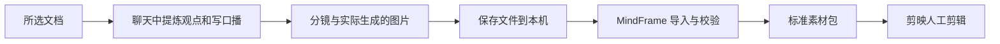

# MindFrame

**在聊天里创作，在本地整理，交给剪映剪辑。**

你把文档交给 ChatGPT，审改观点、口播和分镜，再生成图片。
MindFrame 接收这些**实际文件**，校验场景对应关系，导出标准素材和剪辑清单。
主流程不调用模型 API，不需要 API Key，也不要求 Node、FFmpeg 或剪映已安装。
首次编译仍需下载 Rust 依赖。



## 安装和主流程

需要支持 edition 2024 的 Rust。在仓库根目录执行：

```bash
cargo install --path crates/mindframe-cli
mindframe init /path/to/article.md --out projects/article --preset douyin
```

`init` 只读取这一篇 UTF-8 Markdown（上限64 KiB），生成原文快照、带行号副本和
`chat-request.md`。把请求文件与原文交给聊天助手，按其中的 Schema 创作。
PDF/Word 可以先在聊天中整理成一份忠实的 Markdown 快照；CLI 本身不解析 PDF/Word。

聊天助手负责生成 `storyboard.json`、`assets.json` 与实际图片。保存到本地，例如：

```text
chat-output/
├── storyboard.json
├── assets.json
├── motion.json          # 可选：逐句 Motion Primitives
└── images/
    ├── scene-01.png
    └── scene-02.webp
```

然后运行：

```bash
mindframe import projects/article --from ./chat-output
mindframe validate projects/article
mindframe export projects/article --target jianying --out dist/article
```

**这不是让 CLI 直接调用你的聊天会话。** 它不读取 Cookie、不登录 ChatGPT、不把订阅
额度当作 API 额度；创作发生在聊天中，本地命令处理保存下来的文件。
图像模型由聊天环境决定；只有工具明确提供型号选择时才能保证使用指定型号。
MindFrame 不验证图片来自哪个模型，只验证实际 PNG/JPEG/WebP 文件及其场景映射。
可复用的作者指导见 [prompts/chat-authoring.md](prompts/chat-authoring.md)；
[作者 Skill](skills/mindframe-author/SKILL.md) 是仓库内可移植说明，不代表已经安装到你的聊天环境。

## 视觉导演：保留精华，逐页成图

[mindframe-visual-director](skills/mindframe-visual-director/SKILL.md) 把原文概念、金句、公式与
论证关系转成逐页视觉计划，使用P0/P1/P2文字层级和共享风格，再由实际图像工具逐页生成。
图文成品与剪辑配图区分处理；独立页面不能被一张九宫格总览替代，原文限定不能被抓眼标题抹掉。

新版 `init` 已将完整导演说明和逐页工作表内嵌到 `chat-request.md`，不要求另装第三方Skill。
已有项目的请求不会自动更新；重新安装CLI后用新输出目录初始化，或将新说明补充给聊天助手。
[使用说明与边界](docs/visual-director.md)涵盖独立Skill使用、示例与文件交接。
导演计划和审图记录是另存的Markdown，不新增JSON字段，也不被现有import/export自动复制。

## 编辑源与图片映射

`content/storyboard.json` 是唯一的口播/观点编辑源；`script.md` 和 `key-points.md`
只是导出预览。改稿后重新 `export` 到新目录，不要只编辑预览文件。
`content/assets.json` 维护真实文件、屏幕文字、可选录音与时间点。

```json
{
  "schema_version": 1,
  "images": [
    {"scene_id": "scene-01", "file": "images/scene-01.png", "screen_text": "这一幕的关键词"},
    {"scene_id": "scene-02", "file": "images/scene-02.webp", "screen_text": "第二个概念"}
  ]
}
```

每个场景必须显式对应一张图片；不根据文件排序猜测。支持真实 PNG、JPEG、WebP，
单张上限50 MiB、边长8192像素、解码分配上限256 MiB。导入保留原图字节，统一文件命名，
不自动裁剪、拉伸或重生成。文件扩展名必须与内容相符，图片提示词不是图片。
目标比例与原图不一致时，应在剪映中裁切/留边；`material-report.json` 记录实际尺寸。

项目格式：

```text
projects/article/
├── project.json
├── source.md
├── source.numbered.txt
├── chat-request.md
└── content/
    ├── storyboard.json
    ├── assets.json
    ├── script.md
    ├── key-points.md
    ├── images/
    ├── cover.png            # 可选；按实际格式保留后缀
    └── audio/narration.wav  # 可选
```

## 口播稿不等于配音，文本不等于定时字幕

默认仅需文字和图片。没有录音/时间点时导出 `subtitles.txt`，不生成假的 SRT，
`shot-list.csv` 的时间列留空。你可以在剪映里自行录音、配音和制作字幕。

已有录音时在 assets.json 指定 `audio` 相对路径：仅支持 PCM 16位单/双声道 WAV，
上限256 MiB且不超过一小时。只有录音但没有 cues，仍不自动产生时间戳。
需生成 SRT 时，附与录音匹配且人工核对的逐句 cues，例如：

```json
{
  "scene_id": "scene-01",
  "utterance_index": 0,
  "text": "与这个场景 narration[0] 完全一致的口播。",
  "start_ms": 200,
  "end_ms": 3400
}
```

cues 必须按分镜/句子顺序覆盖全部口播且不重叠；时间不能超过实际 WAV 长度。
程序检查文字一致性和时间范围，**不声称已经听懂并验证语音对齐**。
改口播后旧 cues 会被拒绝，应重新对齐，或明确移除旧录音和 cues 回到未配音素材状态。

## 剪映素材包

导出包含图片、可选封面/录音、口播稿、关键信息、分镜说明、`shot-list.csv`、
`subtitles.txt`、有真实输入时间点时的 `subtitles.srt`，以及导入说明和素材报告。

**不是剪映原生草稿，不会自动排轨、设置转场或发布抖音。**
分镜中的 cut/fade/slide 是人工剪辑建议。CSV/Markdown/JSON 是说明文件，不是可直接
加载的剪映时间线。SRT 的导入入口需在你使用的编辑器版本中确认，本项目没有完成该 UI 验收。

原文完整快照、聊天请求、配置和未引用文件不会复制到导出包；选取的原文引文仍保留在关键点中。
导入/导出拒绝覆盖已有目录。缺图、坏图、错误引用、路径穿越、素材符号链接、损坏录音会明确失败。
使用同目录临时工作区完成后再发布，失败不留下半份 content/ 或导出包；不要并发写同一项目。
再次导入整批素材应创建新项目；局部修订可直接编辑现有 content/ 后重新校验和导出。
ZIP 自动解包、整库扫描、网页抓取、自动配音和原生剪映工程都不属于这条主流程。

## Motion：从已对齐素材直接生成知识讲解 MP4

聊天素材项目如果已经有**实际 WAV 录音**和覆盖全部口播的**已核对逐句 cues**，可以直接生成轻量知识讲解视频：

```bash
mindframe motion projects/article \
  --out dist/article-motion \
  --preset douyin \
  --renderer renderer/remotion
```

Motion V1 使用每个 scene 的真实图片作为背景，自动做低干扰的缓慢缩放/漂移；`screen_text` 作为独立重点层，逐句字幕严格使用已提供 cue 时间，整条旁白使用实际导入的 `audio/narration.wav`。没有录音或完整时间点会直接失败，不按字数猜时长。

输出包含 `motion.mp4`、`cover.png`、`motion-input.json` 与 `subtitles.srt`。当前支持静态背景产生轻运动，不导入外部 MP4 背景，不做词级高亮，也不是剪映原生工程。公式如需精确数学排版，应在 `screen_text`/后期排版中提供准确文本并人工检查；Motion V1 不解释 LaTeX。

可选的 `motion.json` 用于逐句动态图解。它不是任意动画 DSL，而是随 narration 句子切换的完整视觉状态快照。固定原语：

- `text`：核心论点/结果；
- `stat`：人物、时间、数字或收益；
- `relation`：两个元素之间的简单关系；
- `matrix`：小型收益矩阵/决策表；
- `formula`：公式显示字符串和一个可选高亮子串。

同 id 在下一步继续出现表示同一个对象；值改变表现为替换，新增 id 淡入，`emphasis` 提示重点。布局只使用 top/left/center/right/bottom 五个 slot，不接受 JavaScript、CSS、任意坐标或任意动画命令。没有 `motion.json` 的旧项目继续使用 screen_text 简单重点层。

## 可选的旧 API / Remotion 路线

之前的 `plan / build / produce / render / demo` 仍保留，用于旧的根目录
`source.md + storyboard.json + timeline.json` 项目，不是新素材格式的隐式后端。
它们需要各自的模型配置、Node/Remotion/FFmpeg 等依赖；API 命令可能产生费用。
新格式执行 produce/render 会提前报错，不会悄悄调用收费服务。
说明见 [docs/legacy-video.md](docs/legacy-video.md)。

## 验收

```bash
cargo clippy --workspace --all-targets -- -D warnings
cargo test --workspace
cargo build --workspace
python3 scripts/chat_smoke.py --out output/chat-smoke
```

核心测试清空环境变量与 PATH 后启动实际 CLI，检查无密钥导入/导出、图片字节保留、
WAV与手工时间点、错误输入及非覆盖行为。冒烟素材是程序生成的测试 PNG 与静音 WAV，
**不是 GPT 生成图片、真实配音或艺术质量评估**。

完整旧视频验收仍使用 `python3 scripts/check.py` 和
`python3 scripts/integration_test.py --out output/<new-directory>`。
研发状态见 [EP-001](docs/exec-plans/active/ep-001_v1/EXECPLAN.md)。
