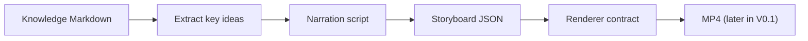

# MindFrame

Turn knowledge into visual stories.

MindFrame is a knowledge-to-video pipeline for technical, conceptual, and philosophical content. The initial goal is to transform trusted source material into a structured narration and storyboard that can later be rendered into publishable video.

## V0.1 scope

The first milestone intentionally keeps the main path small:



Current implementation focuses on the deterministic domain model and CLI entrypoint first. Rendering, image generation, and TTS are added only after the storyboard contract is proven useful.

## Architecture

- **Rust**: core domain model, pipeline orchestration, CLI, validation.
- **TypeScript / Remotion**: visual rendering layer.
- **FFmpeg**: media assembly and encoding.
- **RepoFoundry AI**: engineering governance, ADRs, execution plans, checkpoints.

See [ARCHITECTURE.md](./ARCHITECTURE.md).

## Development principles

Development follows the project rules in [docs/engineering/development-principles.md](./docs/engineering/development-principles.md):

- solve the actual workflow before adding extensibility;
- fast-fail at system boundaries;
- validate once at the layer that owns the information;
- prefer linear, locally readable orchestration;
- add abstractions only when they hide real complexity or remove meaningful duplication;
- keep changes minimal and reviewable.

## Build

```bash
cargo build --workspace
cargo test --workspace
cargo run -p mindframe-cli -- --help
```

## Planned V0.1 CLI

```bash
mindframe build examples/hello.md
```

Expected project artifacts will evolve toward:

```text
output/
├── script.md
├── storyboard.json
├── assets/
├── voice.wav
├── subtitles.srt
└── final.mp4
```

The repository is deliberately incomplete while the V0.1 contracts are being established.
