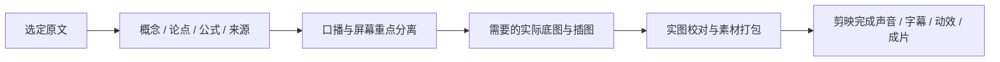

# 使用 MindFrame Visual Director

这是一套**素材创作与剪辑交接工作流**。它不自动控制剪映，不默认生成 MP4，也不要求音频或 cues。



## 取得当前指导

```bash
cargo install --path crates/mindframe-cli --force
mindframe init /path/to/article.md --out projects/article --preset douyin
```

上传 source.md 和 chat-request.md。新版 init 在编译时内嵌作者提示、完整 Skill、工作表以及
Storyboard/Assets/Motion/Layers Schema；在仓库外运行无需重新上网查这些文件。
旧请求不会自动改写，使用新目录初始化或把新 Skill 作为补充。

示例要求：

> 按知识讲解模式准备剪映素材包，采用深海星辰风格。保留原文的路径依赖、反身性和状态方程。
> 口播与重点文字分开，按需要生成无字底图和独立图解，不做九宫格，不默认生成 MP4 或测试配音。
> 提供实际文件和按口播触发的剪辑说明。

## 分工

背景负责低干扰的阅读氛围；重点层呈现概念、公式和必要关系；口播负责解释；字幕由实际声音决定。
保持简单，不把所有段落画进海报，不强制每镜更换背景，也不为纯文字概念生成无用装饰。

storyboard.json 是唯一口播编辑源。assets.json 是主图与后期叠字清单。
layers.json 可选，登记实际叠加图片；motion.json 可选，组织逐句状态，导出人能照着做的剪辑指导。
新增 id、保留 id、改变内容和省略 id 分别表现为新增/保持/更新/移除说明，不是剪映自动动作。

准确公式字符串保留；需要独立位图时另行排版和校对。PNG不能逐字修改，不能拿它冒充原生文字层。
默认不配音，声音与语速定稿后再做字幕；没有录音不造秒数或 SRT。

## 实际文件与验收

[素材包文档](editor-pack.md) 说明 narration.txt、scripts/、screen-text/、edit-notes/ 和叠加图。
只有存在的真实文件才写清单；PNG/JPEG/WebP均需真实格式。透明性按像素报告，不由后缀猜测。
visual-plan.md 与 review.md 单独保存，不自动公开工作笔记。

CLI校验文件、映射和范围；Skill的内容/公式/审美检查必须看过真实素材后才能记录 pass。
未知或未看过写 unverified，待修写 revise；CI通过不等于成品美观、声音自然或发布效果好。

独立使用时提供完整 skills/mindframe-visual-director/ 目录。仓库里有文件不等于宿主已安装，
不代表能选择未暴露的图像型号。保留历史图文示例，它只是合成协议示范，不是默认视频交付。
只有明确需要内部结构样片时参考[预览文档](preview.md)，不绕过项目另写临时成片脚本。
