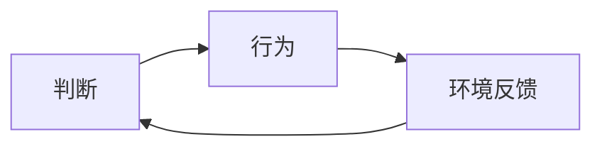

# 三页方案演示：不把概念稀释成口号

输入是[原创合成素材](source.md)，不是用户的 Wei-Book 文档。这里只做方案；未生成图片，所有视觉审核状态均为 unverified。
[分镜示例](storyboard.example.json)与[素材清单示例](assets.example.json)用于协议测试。清单中的图片尚不存在，不能直接 import；测试会另外生成合成小图，不冒充 GPT 成品。

## 整组约定

图文成品模式；目标9:16。三页是演示范围，不是平台推荐页数。纸白底、墨黑主字、蓝色行动线、灰色环境条件线；同类关系同色，不用颜色暗示性格优劣。
P0 主标题，P1 定义与必要限定，P2 英文译名/符号说明。页码保持同一位置；三页分别用分支、闭环、公式，避免连续重复人物背影。

## 锚点与页表

| 原文位置 | must_keep | 页面 | 呈现 |
|---|---|---|---|
| source.md:L5 | 路径依赖；未来不唯一 | scene-01 | 概念标题+历史/分支结构 |
| source.md:L7 | 反身性；不是心想事成 | scene-02 | 行动与环境中介不可省略 |
| source.md:L9,L11,L13 | 受约束的能动性；完整公式；示意模型限制 | scene-03 | 公式+图例+同页限制 |

## scene-01：路径依赖

P0：路径依赖。P1：过去的选择留下习惯，影响下一次选择；不表示只有一种未来。
P2：Path Dependence（译名）。一条历史节点链抵达当下；当下之后仍有多条清晰分支。
原文L5是定义依据，P1是忠实改写，不能署名某位哲学家或标作原文名言。

生成说明：制作一张独立竖向概念卡，不含其他页面缩略图。使用整组配色，主标题位于上方，关系图居中，限定句清晰可读。所有分支等同处理，不给任何分支标“注定失败”。
验收：unverified。待检查标题、分支和限制是否同时可见。

## scene-02：反身性

P0：反身性。P1：判断 → 行为 → 环境反馈 → 更新判断；不是心想事成。
P2：Reflexivity（译名）。来源L7；关系表达是原文的可视化，不是外部研究结论。



生成说明：制作一张独立竖向闭环图，沿用整组字级、留白与箭头。正文和闭环不超过一次重复解释。不要画“想法 → 必然实现”；不要省略行为与环境反馈。
验收：unverified。逐箭头检查是否与原文L7一致。

## scene-03：状态转移

P0：状态转移。主公式逐字源自L11：

```latex
S_{t+1} = F(S_t, A_t, E_t, \epsilon_t)
```

P1：行动是输入之一，环境和扰动也参与结果。示意模型，非精确预测人生的定律。
P2：S=状态；A=行动；E=环境；ε=扰动；t=时点。保留受约束的能动性作为本页解释中的概念锚点。
生成说明：制作一张独立公式卡。公式必须可逐符号核对，图例紧邻公式，限制句不放入难以读清的角落。无法准确成图则保持待修，选择准确排版后才成为图文成品。
验收：unverified。特别检查t+1下标、逗号、括号、ε与环境变量。

## 反例审查

以下是明确不能通过的候选说明，不是测试过的实际图片：

| 候选问题 | 判定 | 修订 |
|---|---|---|
| 三页缩成一张九宫格 | revise | 分别生成三个实际文件 |
| 外向分支金色直达成功、内向分支灰色坠落 | revise | 移除无来源的结局与性格评判 |
| `Future = P(...)` | revise | 不把结果与概率分布混写；本例不添加该公式 |
| 公式遗漏E或ε，但标题更醒目 | revise | 恢复环境、扰动与对应图例 |
| 只交提示词并填满assets.json | unverified | 尚无图片，不宣称素材已齐全 |

这里的状态是对文字方案的审查，不是机械验图能力的证明。实际出图后仍需看图和手机尺度校对。
